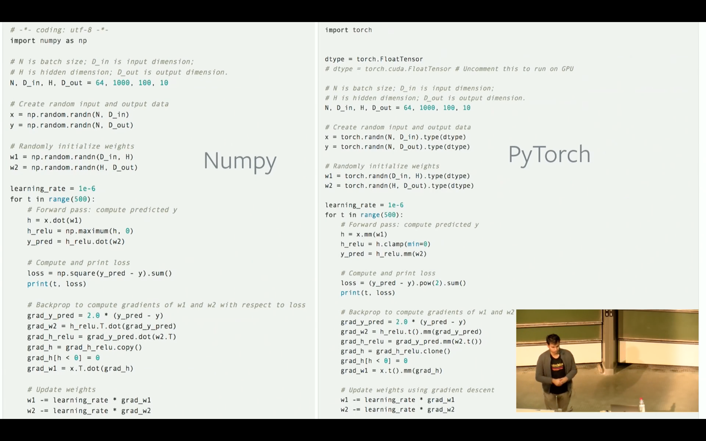

# EuroSciPy 2017: Keynote on PyTorch
### PyTorch:  Framework for fast, dynamic deep learning and scientific computing (31-Aug-2017), Soumith Chintala
- https://www.youtube.com/watch?v=LAMwEJZqesU

### PyTorch
- deep learning framework
- scientific computing package
- development began in summer 2016
- started as an intern project

### History
- previously was a package called Torch which was written in Lua
- they ran Torch for a while, downside was there was no ecosystem for Lua, no standard library
- they were thinking of writing a new version of Torch, Python seemed to be the best ecosystem
- Torch was 7-8 years old at the time

### PyTorch
- has an Ndarray library with GPU support, it is a Numpy alternative
- has an **automatic differentiation package** for computation
  - deep learning
  - reinforcement learning
- gradient based optimization package
  - in implements a lot of standard gradient descent optimization methods
- has utility packages
  - data loading
  - automatically downloading pre-trained models from the internet, etc
  
#### ndarray library
- just like numpy provides an ndarray object, PyTorch has a `torch.Tensor`
  - there are different tensor types: float, double tensor, long tensor
  - `torch.Tensor` is the default type, which is **float tensor**
- 200+ operations:  linear algebra, indexing, ...
- very fast acceleration on NVIDIA GPUs
- unit tests are passing, still some issues...

<br>
   
<br>

### Seamless GPU Tensors
- doing CPU to GPU transfers is fairly expensive
- you wouldn't want to have an automatic way of figuring out where to allocate memory
- doing it explicitly gives the user a lot of power

```python
if torch.cuda.is_available():
    x = x.cuda()
    y = y.cuda()
    x + y
```    
- if there is a library missing on the CPU side, you can always convert the tensor to a numpy array and call scipy operations

## Automatic Differentiation Engine

### PyTorch Autograd
- Autograd is a PyTorch package for the differentiation for all operations on Tensors. It performs the backpropagation starting from a variable. In deep learning, this variable often holds the value of the cost function. backward executes the backward pass and computes all the backpropagation gradients automatically.
- Python also has an autograd package, which is the original automatic differentiation package by some Harvard folks
- the right name for package should have been `torch.autodiff`
- a Variable is something that loosely wraps a tensor
- you put a tensor inside a Variable and then on this Variable, you can do a lot of operations; the sequence of operations will be recorded by this Variable
- 

```python
from torch.autograd import Variable

x = Variable(torch.randn(1, 10))
prev_h = Variable(torch.randn(1, 20))
W_h = Variable(torch.randn(20, 20))
W_x = Variable(torch.randn(20, 10))

i2h = torch.mm(W_x, x.t())
h2h = torch.mm(W_h, prev_h.t())

next_h = i2h + h2h
next_h = next_h.tanh()
```

## Optimization Package
- SGD, Adagrad, RMSProp, LBFGS, etc
```python
for input, target in dataset:
    optimizer.zero_grad()
    output = model(input)
    loss = loss_fn(output, target)
    loss.backward()
    optimizer.step()
```
### Machine Learning Workflows

### Work Items in Practice

## Writing Data Loaders
- every dataset is slightly differently formatted
- have to be pre-processed and normalized differently
- need a multi-threaded Data Loader to feed GPUs fast enough

### PyTorch Solution
- share data loaders across the community!
- have packages that share so that you don't have to write the same data loader that some other person somewhere else wrote
  - it has been fairly successful, they have receiving many pull requests to add more and more datasets, particularly academic
- Vision package
- Text package
- Audio package - just began
- Do you need to use PyTorch data loaders to use pytorch?  no, you can use regular Python to write torch datasets and leverage existing Python code
- Example:  ParlAI, project released by Facebook

### Interfacing with Environments

### Debugging
- PyTorch is a Python extension
- can use PyCharm
- can use `pdb`
- can use `print(foo)`

### Identifying Bottlenecks
- PyTorch is a Python extension
- Use your favorite Python profiler

### Compilation Time
- PyTorch is written for the impatient
- absolutely no compilation time when writing your scripts whatsoever
- all core kernels are pre-compiled

### Ecosystem
- use the entire Python ecosystem at your will
- Including SciPy, Scikit-learn, etc
- A shared model-zoo
  - We provide pre-trained models for the ResNet variants and AlexNet, using the PyTorch `torch.utils.model_zoo`.  These can be constructed by passing `pretrained=True` 
```python
import torchvision.models as models
resnet18 = models.resnet18(pretrained=True)
alexnet = models.alexnet(pretrained=True)
```

### Linear Style of Programming
- PyTorch is an imperative / eager computational toolkit
- we built all the APIs so that you, as a user, ... you will write code from top down, you can interactively write it in IPython
- there are other models of building neural networks, and bulding training
- Not unique to PyTorch
  - Chainer, Dynet, MXNet-Imperative, TensorFlow-imperative, TensorFlow-eager, etc.
- Least overhead, designed with this in mind
  - max of 20 to 30 microseconds overhead per node creation
  - vs several milliseconds / seconds in other options
  
## The Philosophy of PyTorch
- Stay out of the way
- Cater to the impatient
- Promote linear code-flow
- Full interop with the Python ecosystem
- Be as fast as anything else

## Recent and Upcoming Features

### Distributed PyTorch
- MPI Style distributed communication
- Broadcast tensors to other nodes
- Reduce tensors among nodes
  - for example, sum gradients among all nodes
  
## Higher Order Derivatives
- grad(grad(grad(grad(grad(grad(torch.norm(x)))))))
- useful to implement crazy ideas

## Broadcasting and Advanced Indexing
- numpy-style broadcasting
- numpy-style indexing that covers advanced cases

## JIT Compilation (Just-In-Tme) (coming)
- on pytorch github repo
- A full tracing JIT used to cache and compile subgraphs
```python
@torch.jit.trace
def foo(x):
  ...
```
- fuse operations on the fly and generate optimized code
- user tracer to ship models to other frameworks such as Caffe2, TensorFlow and pure C++ runtimes


