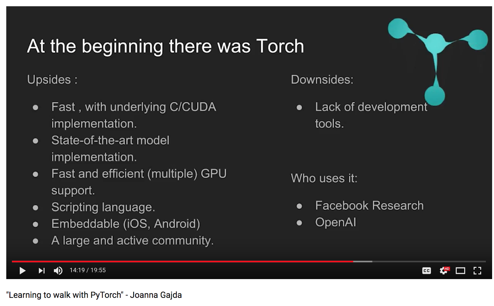

# "Learning to walk with PyTorch" - Joanna Gajda
- https://www.youtube.com/watch?v=4RzoFWre44Y

## Pytorch
- Python + Torch ---> **PyTorch**
- good for research, maybe not the best for **production**
- the machine learning world loves Python

 
   
 

