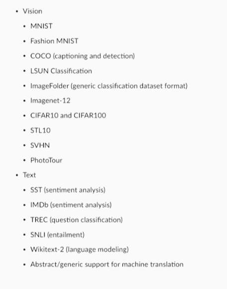

# PyTorch a framework for research of dynamic deep learning models
## Adam Paszke (34 minutes)

### good video!
- https://www.youtube.com/watch?v=BZyKufPCKdI
- by one of the creators of PyTorch


### Data Loading `20:10`
- there are vision and text datasets available


#### Datasets
- [CIFAR-10 and CIFAR-100](https://www.cs.toronto.edu/~kriz/cifar.html)
  - The CIFAR-10 and CIFAR-100 are labeled subsets of the 80 million tiny images dataset. They were collected by Alex Krizhevsky, Vinod Nair, and Geoffrey Hinton.
  - The CIFAR-10 dataset consists of 60000 32x32 colour images in 10 classes, with 6000 images per class. There are 50000 training images and 10000 test images. 
  - The dataset is divided into five training batches and one test batch, each with 10000 images. The test batch contains exactly 1000 randomly-selected images from each class. The training batches contain the remaining images in random order, but some training batches may contain more images from one class than another. Between them, the training batches contain exactly 5000 images from each class. 

<br>
   
<br>

### `DataLoader`
A single class for:  
- multiprocess paraellel data loading
- shuffling
- batching
- memory locking (for faster CUDA transfers)

### Python Integration


### ONNX Package
- use the onnx pip/conda package to load and run on different backends (Caffe2, CNTK, hardware)!
```python
import torch
from torch.autograd import Variable
from torchvision import models

model = models.resnet18()
example_input = Variable(torch.randn(1, 3, 224, 224))
torch.onnx.export(model, example_input, 'resnet18.onnx')
```

## Performance Optimization
- they spent a lot of time making AutoGrad blazingly fast
- working on a jit (just in time) tracing component for models
- don't use `jit` for now, it is **experimental** right now, it can only handle **static** models right now
- also what they use for onnx export
- they are working on adding support for control flow so in some of the later releases this is also going to be supported, but if you have an RNN which is a dynamic loop over a dynamic length, you really have this inside the subgraph of the RNN so itself is static
- you can just decorate the function of the RNN and if you do some small modifications of LSTM, you can no longer use CUDA, really fast kernels, so the performance drops quickly
- so you just add `@compile` and we see 2-3x improvements in runtime

```python
import torch.nn as nn
from torch.jit import compile

@compile
class MyModel(nn.Module):
    ...
    
@compile
def model(input, *weights):
    ...
```

## Release
- PyTorch was released in January 2017
- 200K+ downloads
- 1500+ community repos
- 11,500+ user posts on forums
- 290 contributors

