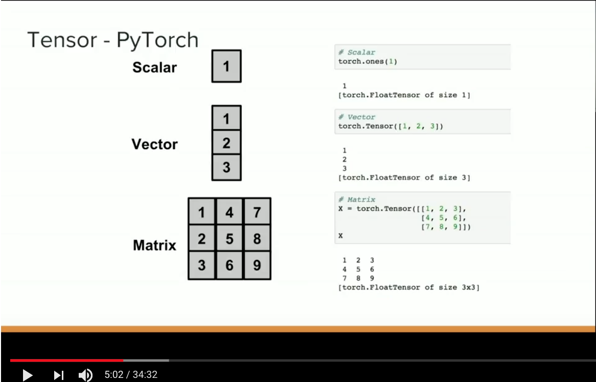
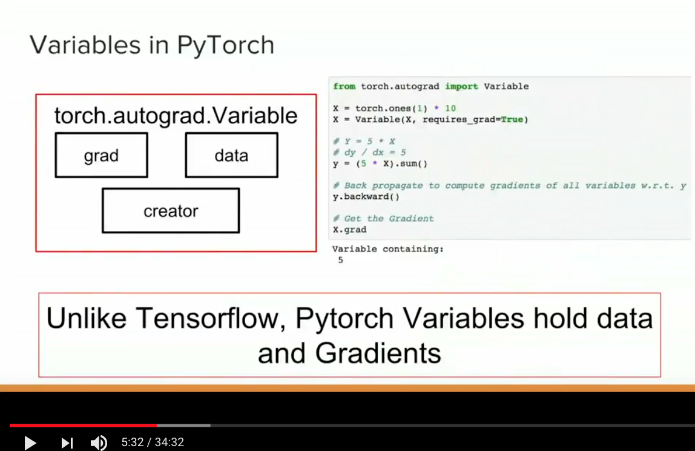
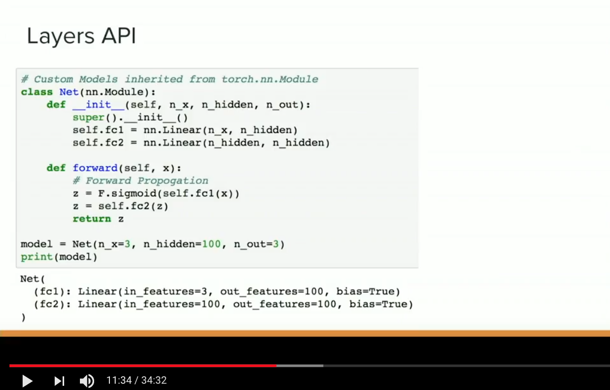

# Deep Learning with PyTorch - Ramesh Sampath
## SF Python Meetup - Feb 2018 (35 minutes)
- Video:  https://www.youtube.com/watch?v=Uw4UQrHagSM

## Files
- https://github.com/sampathweb/pytorch-intro-workshop
- https://github.com/sampathweb/pytorch_tutorial
- https://github.com/utkuozbulak/pytorch-custom-dataset-examples
- https://github.com/Atcold/pytorch-Deep-Learning-Minicourse


### Deep Learning Frameworks
- Tensors and Variables
- Computation Graphs
  - Automatic Differentiation
  - Runs on GPU
- Layers API
- Data Loaders - good and efficient data loading capabilities
- Deploy Models

### Tensors & Variables
- PyTorch has deep integration with numpy

#### Tensors
- DEFINITION:  Tensor is an n-dimensional array
- tensors are just arrays (or lists in Python)
- its API is very similar to numpy API
- it will evaluate immediately

<br>
   
<br>

#### Variables in PyTorch
- variables are a wrapper around tensors
- PyTorch variables hold **gradients** along with **data**
- that is very useful later on when we try to debug our network
- holding gradient with data makes our job easier when using APIs

### PyTorch vs TensorFlow
- Imperative vs. Declarative
- PyTorch evaluates as it goes
- TensorFlow 

```python
from torch.autograd import Variable

X = torch.ones(1) * 10
X = Variable(X, requires_grad = True)

# Y = 5*X
# dy/dx = 5
y = (5 * X).sum()

# back propogate to compute gradients of all variables w.r.t y
y = backward()

# Get the gradient
X.grad
```

<br>
   
<br>

### Logistic Regression in PyTorch

#### Layers API
- can define a model
- which can also be defined as a Python class which inherits an `nn.Module`
- this is what differentiates PyTorch from the rest of the frameworks
- being able to define it as a class and your own forward propagation which means you can write your own Python code to debug, evaluate, reroute.
- you can do all sorts of things in this forward propagation
- you don't have to write the backward propagation (you can), but it is automatically differentiated, it keeps the computation graph and differentiates automatically
- `F` is a functional API, so sigmoid has no parameters, so you only want to show the state of things that have parameters

<br>
   
<br>

## Non-linear Dataset
- spiral dataset, 3 classes `12:08`
- simple models will not be able to separate these groups
- let's go to a one hidden layer network.  we'll have two inputs again;  we will have 2 inputs and 3 output classes


### Defining a Class in PyTorch
#### Neural Net:  One Hidden Layer
```python
# Linear Model
class Net(nn.Module):
    def __init__ (self, n_x, n_hidden, n_out):
        super().__init__()
        self.fc1 = nn.Linear(n_x, n_hidden)
        self.fc2 = nn.Linear(n_hidden, n_out)
        
    def forward(self, x):
        z = self.fc1(x)
        z = self.fc2(z)
        return z
```
- Ramesh remembered to add a non-linear activation, sigmoid function to model, to capture non-linear relationship
- these things you can easily find out by doing plots, etc
- ran model with one hidden layer, and it wasn't performing well
- so Ramesh increased the number of hidden nodes / layers
- it improved, but accuracy still at 60%
- what to do next?  this happens in real life with problems, and you think of it as a black box in deep learning that you cannot unpack
- unless... you are working with PyTorch.  Then, you could actually say, in our training function, I actually extracted the gradients of each layer, and then, because **gradients** and **weights** are stored together, I extracted the gradients, and then I plotted the gradients
- you can see the red line is the gradient of the last layer, and the blue line is the gradient of the first hidden layer, and the gradient dies at 30 epochs, if I keep running for 3000 runs, it will make no difference because there is no loss getting propagated 
- this is called **vanishing gradient problem**
- now that we know what the problem is, we can take some corrective actions which are:  
    - adding more layers / nodes
    - I have a choice of activation functions for the hidden layer
    - we tried sigmoid, it seemed to have a gradient problem
    - we can try and edge, we can try ReLU
    - 
    
- you can visualize the gradient:  https://dashee87.github.io/data%20science/deep%20learning/visualising-activation-functions-in-neural-networks/
- ReLU will fully propagate entire loss to the previous one
- a lot of people choose ReLU or a variation of ReLU for all hidden layers until the final layer
- so, let's change our network to use ReLU
- same architecture, same 32 hidden nodes, same 50 epochs
- we now have 98% accuracy!, which is what you want to see
- what's more important is actually how it nicely separates these 3 classes in this spiral dataset
- we should also plot the gradients just to see how it is
- you see the red line which is the first layer, and the green line which is the last layer
- you can see a lot of places where the gradient nicely propagates the earlier layers and you can see that you don't have that big of a vanishing gradient problem
- it can happen in ReLU as well, because you are setting half the neurons to 0, when the activation is 0, but it's got less of a problem, so 
- this is one of the powerful reasons I actually like PyTorch is that you may not consider yourself as a researcher, but this is the kind of problem we encounter all the time:  the model doesn't train as well, and how do you go from there to debug to why it is not working.
- that's something Ramesh found PyTorch to be easier to access
- I'm sure the same things can be done in TensorFlow or Keras, but it may not be as simple

## Computation Graph
- skipping this section because of time

## Data Loaders
- Ramesh's favorite topic as to why PyTorch is really awesome
- most of the time we are working with our own datasets and not dealing with some tutorial datasets or some fabricated dataset
- how do we use our datasets as inputs to these models?
- that's the real challenge, and how does PyTorch do it?

### PyTorch Data Loader
- It defines 3 things:
    1.  There is a **Dataset** object and a **Data Loader** object.
        - Data Loader - is just a wrapper around an object, it makes it a generator, so then it feeds back
        - once you wrap your data set in a data loader, you can do this:
```python
# Use DataLoader in training looop - one epoch
for batch_idx, (X, y) in enumerate(dataloader):
    # Train the batch
    pass
```
- it will give you each batch at a time, then how complex is this dataset object for my data? 
- so you define your custom dataset class that inherits from TD dataset and you define 3 things:
  - `init` you can take any sort of things, X, y, your dataframe, often csv files that has reference to images
  - `len` will tell you how long is your dataset so that it can how many batches to run
  - `get_item` is, for a single index, give me a single value; so what it does is multi-processing and then it will load a bunch of these custom dataset objects and then generate these values
  
```python
# Data Loaders

import torch.utils.data as td

class CustomDataset(td.Dataset):
    def __init__(self, X, y, transforms=None):
        pass
    
    def __len__(self):
        # return the length of dataset (number of total examples)
        pass
        
    def __getitem__(self, index):
        # return the X, y at that index
        pass
```
#### Spiral Object - dataloader example

#### input validation
- makes sure input is numpy array or actually a torch tensor, that is all it is doing

#### dataloader
- once I have this custom dataset defined, I can pass it to dataset loader 
- I indicate how large a batch size I want
- I shuffle the data, and it has a bunch of other parameters it could do
- 

## Deployment

## Pytorch Core Packages

```python
import torch as torch
```

- torch is the main package
- Loads of subpackages (autograd, nn and more)
  - torch:  Tensor (i.e. ndarray) library
  - torch.autograd:  automatic differentiation
  - torch.nn:  neural network library
  - torch.optim: standard optimisation methods (SGD, RMSProp, etc)
  - torch.multiprocessing: magical memory sharing
  - torch.utils: loading and training utility functions
- torchvision and torchtext 
  - collection of transforms, datasets and pretrained models for Tmages and Text
    
## Visualizations
- PyTorch has said they won't build visualizations, but you can use TensorBoard
- Visdom

    
    
    
    


